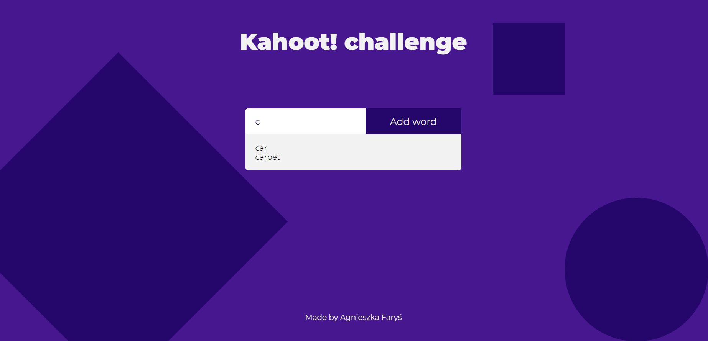

# 🟣 Kahoot! Challenge 🟪
Contains Kahoot! auto-completion task for summer internship program.

  <kbd>
    
  </kbd>

## Description
Web application using JavaScript, HTML and CSS. Uses a premade disctionary with a feature allowing to add new queries. There is also an option to autofill queries by clicking on the from the list.
